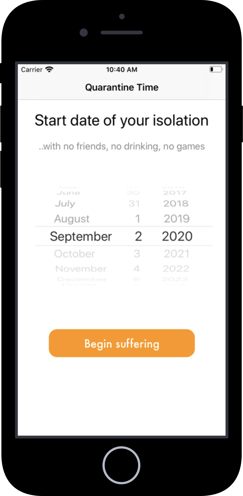

# Um estudo comparativo entre os frameworks de desenvolvimento nativo UIKit e SwiftUI da plataforma iOS

Nesse repositório, foi desenvolvivo 4 aplicações para que fosse possível fazer um comparativo de desempenho entre esses frameworks. Foi considerado para comparação métricas de uso de CPU, uso de memória RAM e quantidade de linhas de código necessárias para implementação dessas aplicações. Além disso, queremos que esse repositório sirva como referência para que desenvolvedores e empresas escolham qual framework se encaixa melhor dependendo dos objetivos da aplicação que irá ser desenvolvida.

## Resultados Obtidos

### App 1: Catálogo de Músicas dos Beatles

Essa aplicação apresenta um catálogo de músicas dos Beatles, com um total de 213, dispostas em uma lista com o nome e ano de lançamento de cada música. O resultado final da aplicação é visto na Figura 1.

  <figure align='center'>
    
     
    <figcaption>Figura 1. Capturas de tela do App 1</figcaption>
  </figure>

Para essa aplicação foram medidos o uso de CPU e memória, com a aplicação em descanso e após realizada a ação de rolagem até o final da lista. Os resultados de desempenho para a aplicação em UIKit e SwiftUI estão nas Tabelas 1 e 2, respectivamente. Os resultados para análise de quantidade de linhas de código estão na Tabela 3.

**Tabela 1. Resultados para o App 1 em UIKit**
Estado | Uso de CPU | Uso de Memória
:------------: | :-------------: | :-------------:
Idle | 0% | 14,9MB
Scrolling | 35% | 15,2MB

**Tabela 2. Resultados para o App 1 em SwiftUI**
Estado | Uso de CPU | Uso de Memória
:------------: | :-------------: | :-------------:
Idle | 0% | 17,7MB
Scrolling | 50% | 18,6MB

**Tabela 3. Linhas de Código para Aplicação 1**
Framework | Linhas de Código
:------------: | :-------------:
UIKit | 129
SwiftUI | 101

Os resultados indicam um aumento de 15% no uso de CPU e 4,2MB de uso de Memória durante a ação de rolagem da tela na implementação com SwiftUI. Na
implementação em SwiftUI houve uma redução de 27% na quantidade de linhas de código.

### App 2: Catálogo de Álbuns dos Beatles

Essa aplicação apresenta o catálogo de a ́lbuns dos Beatles, um total de 28, disposto em uma lista com uma imagem de capa, nome e ano de lançamento de cada álbum. Nessa aplicação foram utilizados elementos visuais como imagens, textos coloridos, bordas e sombras a fim de aumentar a complexidade visual da lista. O resultado final da aplicação é visto na Figura 2.

  <figure align='center'>
    
     
    <figcaption>Figura 2. Capturas de tela do App 2</figcaption>
  </figure>

Para essa aplicação foi medido o uso de CPU e memória com a aplicação em descanso e após realizada a ação de rolagem até o final da lista. Os resultados para a aplicação em UIKit e SwiftUI estão nas Tabelas 4 e 5, respectivamente. Os resultados para análise de quantidade de linhas de código estão na Tabela 6.

**Tabela 4. Resultados para o App 2 em UIKit**
Estado | Uso de CPU | Uso de Memória
:------------: | :-------------: | :-------------:
Idle | 0% | 24,7MB
Scrolling | 8% | 25,0MB

**Tabela 5. Resultados para o App 2 em SwiftUI**
Estado | Uso de CPU | Uso de Memória
:------------: | :-------------: | :-------------:
Idle | 0% | 26,9MB
Scrolling | 25% | 27,2MB

**Tabela 6. Linhas de Código para Aplicação 2**
Framework | Linhas de Código
:------------: | :-------------:
UIKit | 152
SwiftUI | 106

Os resultados indicam um aumento de 17% no uso de CPU e 2,2MB de uso de Memória durante a ação de rolagem da tela na implementação com SwiftUI. Na
implementação em SwiftUI houve uma redução de 30% na quantidade de linhas de código.

### App 3: Tempo na Quarentena

Essa aplicação conta o tempo de duração de uma quarentena em anos, meses, dias, horas, minutos e segundos. É possível parar o relógio ou recomeçar a contagem da quarentena. O resultado final da aplicação é visto na Figura 3.

  <figure align='center'>
    
     
    <figcaption>Figura 3. Capturas de tela do App 3</figcaption>
  </figure>

Para essa aplicação foram medidos o uso de CPU e memória, com a aplicação em descanso e após realizada a ação de rolagem para a escolha da data, seleção do
botão para o início do tempo de quarentena. Os resultados para a aplicação em UIKit e SwiftUI estão nas Tabelas 7 e 8, respectivamente. Os resultados para
análise de quantidade de linhas de código estão na Tabela 9.

**Tabela 7. Resultados para o App 3 em UIKit**
Estado | Uso de CPU | Uso de Memória
:------------: | :-------------: | :-------------:
Idle | 0% | 32,9MB
Scrolling Date Picker | 34% | 33,6MB
Timer | 0% | 34,5MB
Idle com o tempo rodando | 0% | 33,7MB

**Tabela 8. Resultados para o App 3 em SwiftUI**
Estado | Uso de CPU | Uso de Memória
:------------: | :-------------: | :-------------:
Idle | 0% | 35,6MB
Scrolling Date Picker | 36,5% | 33,6MB
Timer | 3% | 37,2MB
Idle com o tempo rodando | 0% | 36,5MB

**Tabela 9. Linhas de Código para Aplicação 3**
Framework | Linhas de Código
:------------: | :-------------:
UIKit | 421
SwiftUI | 324

Na implementação em SwiftUI, podemos observar que os resultados nesse framework comparado ao UIKit indicam um aumento de 3% no uso de CPU
e 2,9MB de uso de Memória durante a ação de rolagem do componente Date Picker. Além disso, quando o componente Timer logo começa a contagem de tempo há um aumento de 3% no uso de CPU e no uso de 2,7MB Memória e após isso a aplicação em repouso com a contagem do tempo há um aumento de 2,8MB de Memória.
Também nessa implementação houve uma redução de 23% na quantidade de linhas de código.

### App 4: Lembrete de Água

Essa aplicação conta a quantidade de água que o usuário tomou naquele dia baseado em um copo padrão de 200ml e a quantidade ideal a ser atingida é de 2000ml diariamente. Possui um botão para adicionar copos de água e um gráfico com a porcentagem para atingir a meta diária. O resultado final da aplicação é visto na Figura 4.

  <figure align='center'>
    
     
    <figcaption>Figura 4. Capturas de tela do App 4</figcaption>
  </figure>

Para essa aplicação foi medido o uso de CPU e memória com a aplicação em descanso com animação infinita da progressão de procentagem e após realizada a ação de adicionar copos de água. Os resultados para a aplicação em UIKit e SwiftUI estão nas Tabelas 10 e 11, respectivamente. Os resultados para análise de quantidade de linhas de código estão na Tabela 12.

**Tabela 10. Resultados para o App 4 em UIKit**
Estado | Uso de CPU | Uso de Memória
:------------: | :-------------: | :-------------:
Idle | 0% | 29,7MB
Ação do botão na primeira vez | 0% | 29,7MB
Ação do botão na décima vez| 0% | 29,8MB

**Tabela 11. Resultados para o App 4 em SwiftUI**
Estado | Uso de CPU | Uso de Memória
:------------: | :-------------: | :-------------:
Idle | 5% | 32,6MB
Ação do botão na primeira vez | 9% | 33,1MB
Ação do botão na décima vez| 40% | 35,7MB

**Tabela 12. Linhas de Código para Aplicação 4**
Framework | Linhas de Código
:------------: | :-------------:
UIKit | 265
SwiftUI | 227

Na implementação em SwiftUI, podemos observar que os resultados nesse framework comparado ao UIKit indicam um aumento de 5% no uso de CPU
e 2,9MB de uso de Memória durante o estado de repouso com a animação de pulsação. Quando há ação do botão, há um acréscimo crescente do uso de CPU e de
Memória nessa implementação, o que não acontece na implementação do UIKit. No final de 10 interações do botão, vemos que há um aumento de 40% do uso de CPU
e 5,9MB de Memória. Também nessa implementação houve uma redução de 15% na quantidade de linhas de código.
